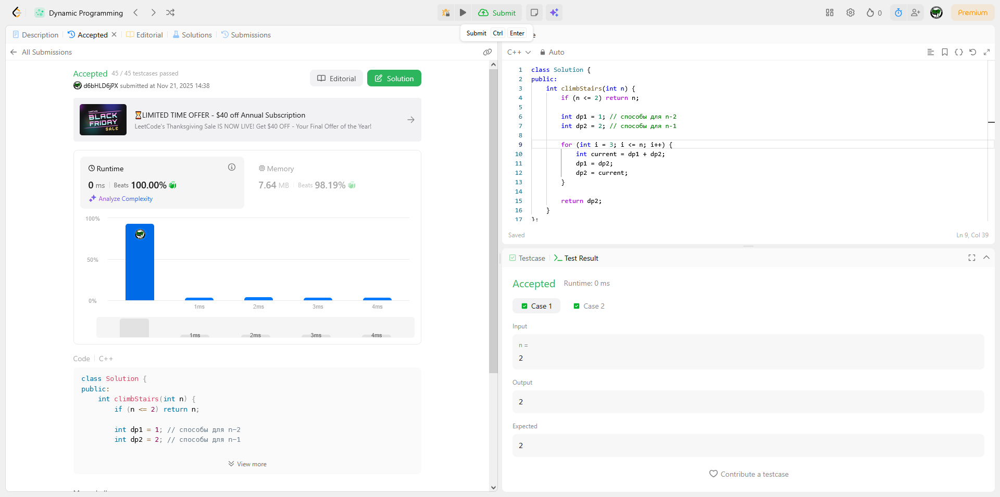
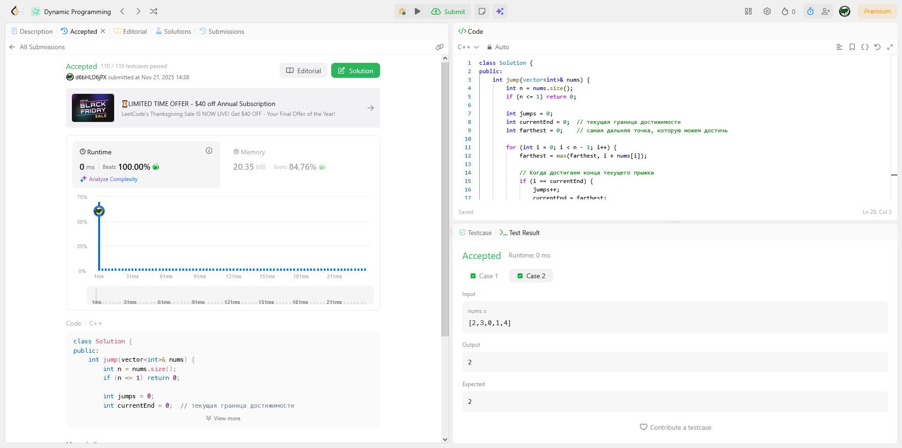
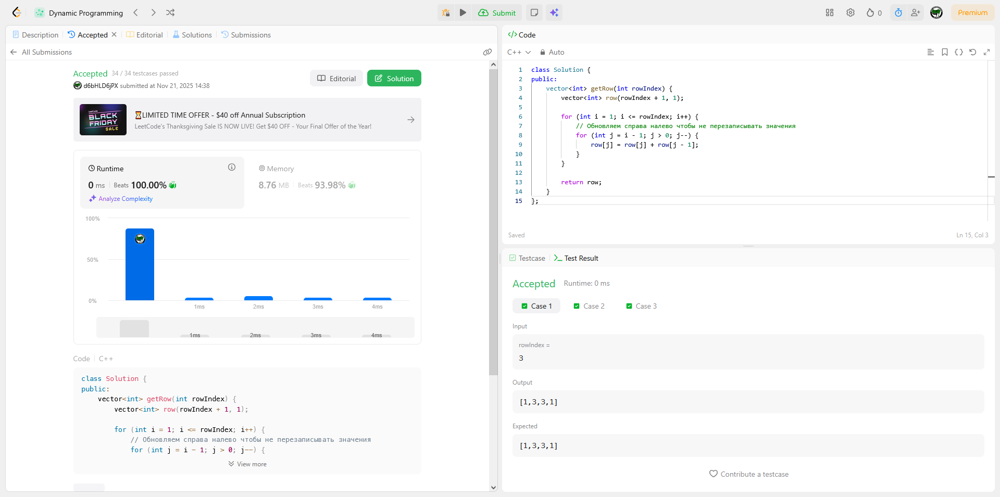
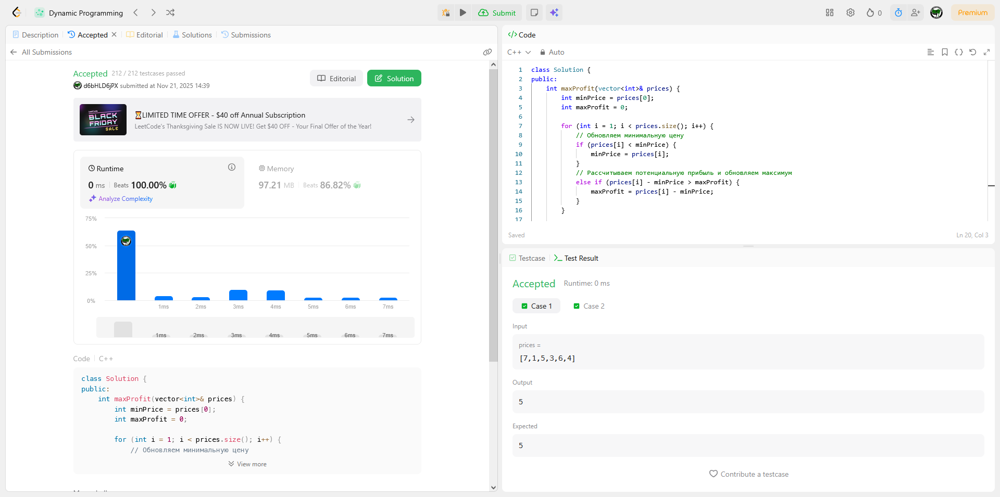
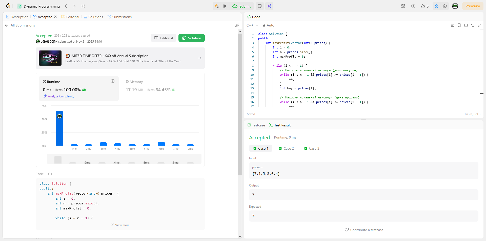

# Отчет о решении алгоритмических задач

## Решенные задачи

### Восхождение по лестнице
Задача поиска количества способов подняться на n-ю ступеньку с шагами 1 или 2 ступеньки. Решена методом динамического программирования через последовательность Фибоначчи.

### Игра в прыжки II
Поиск минимального количества прыжков до конца массива. Применен жадный алгоритм с отслеживанием максимальной достижимой позиции на каждом шаге.

### Треугольник Паскаля
Генерация k-й строки треугольника Паскаля с оптимизацией памяти. Использовано динамическое программирование с одним массивом.

### Торговля акциями
Максимизация прибыли от одной покупки и продажи. Решение через отслеживание минимальной цены и максимальной прибыли.

### Торговля акциями II
Максимизация прибыли при неограниченном количестве сделок. Жадный алгоритм, суммирующий все возрастающие разницы.

## Теоретические основы

### Динамическое программирование
Метод решения задач через разбиение на перекрывающиеся подзадачи с оптимальной подструктурой. Позволяет избежать повторных вычислений путем сохранения промежуточных результатов.

### Big O Notation
Система оценки эффективности алгоритмов, описывающая рост времени выполнения или использования памяти при увеличении объема входных данных. Ключевые классы сложности: O(1), O(log n), O(n), O(n²), O(2ⁿ).

### Мемоизация
Техника оптимизации рекурсивных алгоритмов через кэширование результатов вызовов функций. Преобразует экспоненциальную сложность в полиномиальную за счет дополнительной памяти.
